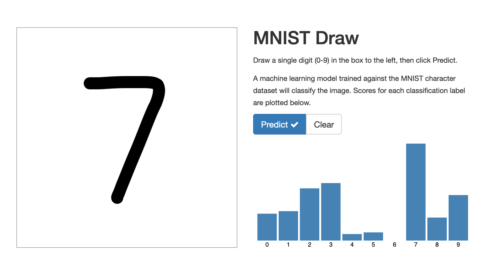

Introduction
------------

This is a demo repository for my blog series for Data Science on Medium.

* https://medium.com/@tsai.liming/part-1-why-containers-for-data-science-c5f19c3a5b16[Part 1: Why Containers for Data Science]
* https://medium.com/@tsai.liming/part-2-building-container-images-for-data-science-858954d1c98d[Part 2: Building Container Images for Data Science]
* Part 3: Deploying your Data Science Containers to Kubernetes (Upcoming)

S2I
---
S2I is used to build the following: 

1. Base Image 
1. Training image for MNIST
1. Flask app for model serving
1. Node.js frontend 

Building
--------

To build the base image with only `Pytorch`

```
$ s2i build pytorch registry.access.redhat.com/ubi8/python-38 --as-dockerfile=/tmp/pytorch/Dockerfile
$ cd /tmp/pytorch/ && buildah bud -f . -t pytorch:l.6.0
```

To build the training image:

```
$ s2i build mnist-flask-app/mnist pytorch:l.6.0 --as-dockerfile=/tmp/mnist/Dockerfile
$ cd /tmp/mnist/ && buildah bud -f . -t pytorch-mnist:latest
```

Once the model is trained, you can wrap it in flask app:

```
$ s2i build mnist-flask-app registry.access.redhat.com/ubi8/python-38 --as-dockerfile=/tmp/flask-app/Dockerfile
$ cp /tmp/model/mnist_cnn.pt /tmp/flask-app/upload/src/model/
$ cd /tmp/flask-app/ && buildah bud -f . -t mnist-flask:l.0
```

To build the Node.js frontend:
```
  $ s2i build . registry.redhat.io/ubi8/nodejs-14 --as-dockerfile=/tmp/mnist-draw/Dockerfile
  $ cd /tmp/mnist-draw/ && buildah bud -f . -t mnist-draw:1.0
```

Training
--------

To run the training image via `podman` and an output folder:

```
$ podman run -it --rm -v /tmp/model:/tmp/model:Z pytorch-mnist:latest
```

MNIST Draw
----------

MNIST Draw is an Express JS frontend that allows the user to draw the number and then makes a JQuery call to the backend Flask app for model inference. 



Follow the above instructions to build the images and run:

```
$ podman run -it --rm -p8080:8080 -e MNIST_SERVER=http://myserver.local:5000 localhost/mnist-draw:1.0
$ podman run -it --rm -p5000:5000 localhost/mnist-flask:1.0
```

Credit
-----

This repository is adopted from the following:

* https://github.com/rhammell/mnist-draw
* https://github.com/hsh2438/mnist_serving_pytorch_flask
* https://github.com/sleepokay/mnist-flask-app